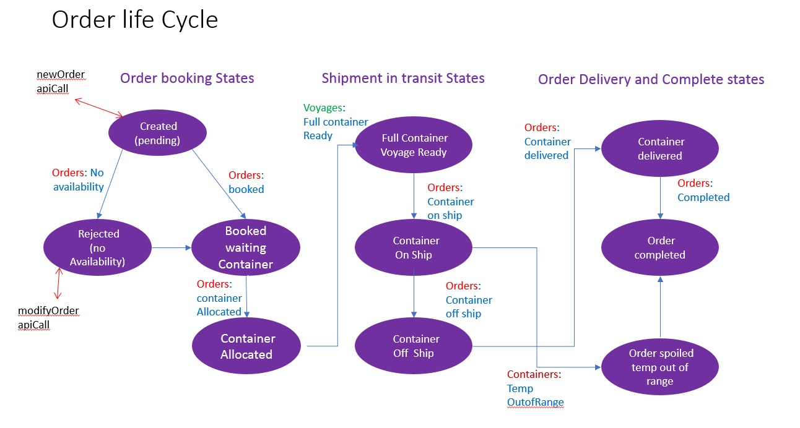
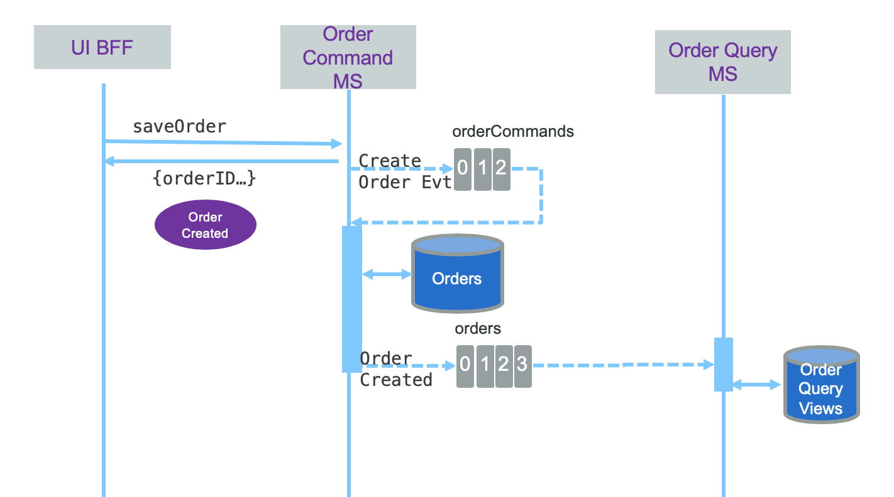
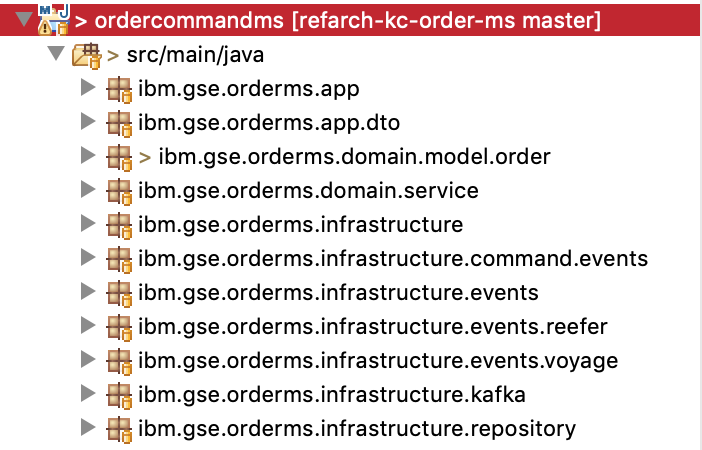
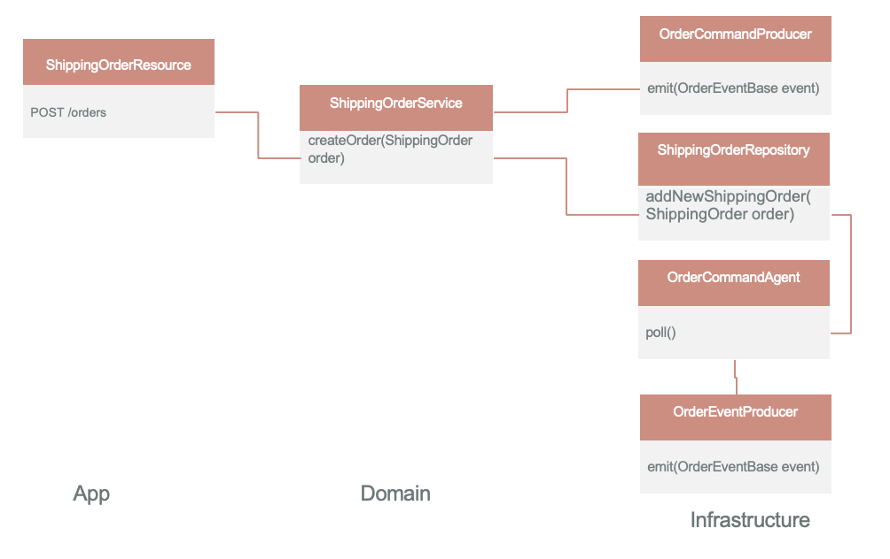

As introduced in the [solution design note](ddd-applied) the order entity life cycle looks like in the following diagram:



The order microservice supports the implementations of this life cycle, using event sourcing and CQRS pattern.

With [CQRS](https://ibm-cloud-architecture.github.io/refarch-eda/design-patterns/cqrs/), we separate the 'write model' from the 'read model'. The Command microservice implements the 'write model' and exposes a set of REST end points for Creating Order, Updating, Deleting Order and getting Order per ID. The query service will address more complex queries to support adhoc business requirements and most likely will need to join data between different entities like the order, the containers and the voyages. So we have two Java projects to support each service implementation. Each service is packaged as container and deployable to Kubernetes. 

* [Order command microservice](https://github.com/ibm-cloud-architecture/refarch-kc-order-ms/tree/master/order-command-ms)
* [Order query microservice](https://github.com/ibm-cloud-architecture/refarch-kc-order-ms/tree/master/order-query-ms)

As some requirements are related to historical query, using an event approach, we need to keep all the events related to what happens to the order. Instead of implementing a complex logic with the query and command services, the event sourcing is supported by using Kafka topics. The following diagram illustrates the CQRS and event sourcing applied to the order management service. Client to the REST api, like a back end for front end app, performs a HTTP POST operation with the order data. The command generates events and persists order on its own data source. The query part is an event consumer and defines its own data projections to support the different queries:

 

The datasource at the command level, may not be necessary, but we want to illustrate here the fact that it is possible to have a SQL based database or a document oriented database to keep the order last state: a call to get /orders/{id} will return the current order state. 

For the query part, the projection can be kept in memory or persisted on its own data store. The decision, to go for in memory or to use a database, depends upon the amount of data to join, and the persitence time horizon set at the Kafka topic level. In case of problem or while starting, an event driven service may always rebuild its view by re-reading the topic from the beginning. 

As the BFF still needs to get order by ID or perform complex queries, it has to access the order service using HTTP, therefore we have prefered to use one communication protocol.  

The following sequence diagram illustrates the relationships between the components over time:



To avoid transaction between the database update and the event published, the choice is to publish the command event to a specific kafka topic as early as the shipping order data is received and use a consumer inside the command service to load the data and save to the database. The kafka topic act as a source of trust for this service. This is illustrated in [this article.](https://ibm-cloud-architecture.github.io/refarch-eda/design-patterns/cqrs/#the-consistency-challenge)

## Code structure

For the order command microservice we implemented a domain driven design structure and try to use the ubiquituous language in the code. The first difficult practice it to well organize the code: The layering approach is used:



* **Core** is the building blocks not specific to any domain or technology, containing generic building blocks like Lists, Maps, Case Classes, Actors and Lenses. 
* **Infrastructure** contains adapters for various technologies such as databases, user interface and external services. 
* **Domain** is where all business logic resides with classes and methods named using the ubiquitous language for the domain. The business logic and rules go there. It has access to infrastructure and core.
* **The App** layer, acts as the entry point to the domain, using Domain terms and objects from the Domain. App includes APIs.
 API should only expose immutable objects to prevent developers from using the exposed objects to gain access to the underlying domain, thus manipulating the domain.

 A given level can see only the components of its layer or lower


### App layer

As defined by the list of commands to implements, most those operations are defined in an API. The unique REST resource is the class: [ShippingOrderResource](https://github.com/ibm-cloud-architecture/refarch-kc-order-ms/blob/master/order-command-ms/src/main/java/ibm/gse/orderms/app/ShippingOrderResource.java)

When the application starts there is a [ServletContextListener](https://docs.oracle.com/javaee/6/api/javax/servlet/ServletContextListener.html) implementation class started to create kafka consumers. When consumers reach an issue to get events, they create an error to the `errors` topic, so administrator user could replay the events from the last committed offset. Any kafka broker communication issue is shutting down the consumer loop.

### Infrastructure Layer

This layer includes Repository and Agents consumer of events as well as event emitters for the command events and the factual events. Normally events are factuals per design. This is just a  little bit of semantic play here, as we are using command events to manage data integrity.


### Domain layer

### Main classes of the command service



* [ShippingOrderResource](https://github.com/ibm-cloud-architecture/refarch-kc-order-ms/blob/master/order-command-ms/src/main/java/ibm/gse/orderms/app/ShippingOrderResource.java)
* [ShippingOrderService](https://github.com/ibm-cloud-architecture/refarch-kc-order-ms/blob/master/order-command-ms/src/main/java/ibm/gse/orderms/domain/service/ShippingOrderService.java)
* [ShippingOrderRepository](https://github.com/ibm-cloud-architecture/refarch-kc-order-ms/blob/master/order-command-ms/src/main/java/ibm/gse/orderms/infrastructure/repository/ShippingOrderRepository.java) This is an interface, but there is a mockup implementation to keep the data in memory.
* [OrderCommandProducer](https://github.com/ibm-cloud-architecture/refarch-kc-order-ms/blob/master/order-command-ms/src/main/java/ibm/gse/orderms/infrastructure/kafka/OrderCommandProducer.java)
* [OrderCommandAgent](https://github.com/ibm-cloud-architecture/refarch-kc-order-ms/blob/master/order-command-ms/src/main/java/ibm/gse/orderms/infrastructure/kafka/OrderCommandAgent.java)
* [OrderEventProducer](https://github.com/ibm-cloud-architecture/refarch-kc-order-ms/blob/master/order-command-ms/src/main/java/ibm/gse/orderms/infrastructure/kafka/OrderEventProducer.java)


## Data and Event Model

By applying a domain-driven design we can identify aggregates, entities, value objects and domain events. Those elements help us to be our information model as classes. For any event-driven microservice you need to assess what data to carry in the event and what persist in the potential data source. 
The following diagram illustrates the different data models in the context of this order microservice:


The Order entered in the User interface is defined like:
```
 class Address {
    street: string;
    city: string;
    country: string;
    state: string;
    zipcode: string;
}

 class ShippinOrder {
    orderID: string;
    customerID: string;
    pickupAddress: Address;
    destinationAddress: Address;
    productID: string;
    quantity: string;
    expectedDeliveryDate: string;   //  date as ISO format
}
```

The information to persist in the database may be used to do analytics, and get the last status of order. It may use relational database and may have information like Address table, ShippingOrder table and ReeferOrder join table.

### Command Events

We did use command event to avoid XA transaction between kafka and database. So we use a 'private' topic: `orderCommands` to queue the command to create or update a Shipping order. The command microservice has an agent to consumer such events, get the shipping order data and save to the database.

### Factual Events

On the event side we may generate OrderCreated, OrderCancelled,... But what is in the event payload? 

We can propose the following structure where type will help to specify the event type and by getting a generic payload we can have anything in it.

```
class OrderEvent {
    orderId: string;
    timestamp: string;   //  date as ISO format
    payload: any;
    type: string;
    version: string;
}
```

`version` attribute will be used when we will use a schema registry.

There are other questions we need to address is real project:

* do we need to ensure consistency between those data views? 
* Can we consider the event, which are immutable data elements, as the source of truth? 

In traditional SOA service with application maintaining all the tables and beans to support all the business requirements, ACID transactions support the consistency and integrity of the data, and the database is one source of truth. With microservices responsible to manage its own aggregate, clearly separated from other business entities, data eventual consistency is the standard. If you want to read more about the Event Sourcing and CQRS patterns [see this article.](https://ibm-cloud-architecture.github.io/refarch-eda/evt-microservices/ED-patterns)

